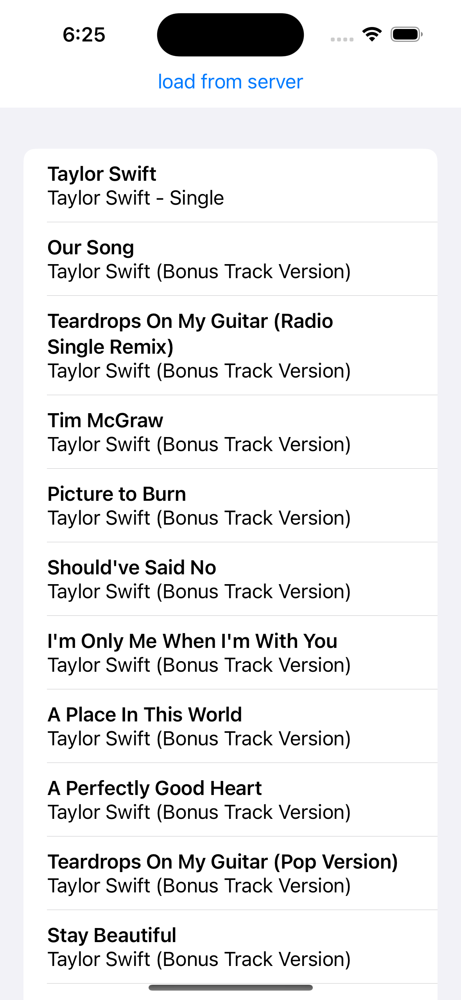

# Simple Server Interaction Test  




```swift
func loadData(){
    guard let url=URL(string: "http://itunes.apple.com/search?term=taylor+swift&entity=song")else{
        print("Invalid URL")
        return
    }
    
    let request = URLRequest(url: url)
    
    URLSession.shared.dataTask(with: request){ data, response, error in
        if let data = data{
            if let decodedResponse = try? JSONDecoder().decode(Response.self, from: data){
                DispatchQueue.main.async {
                    self.results = decodedResponse.results
                }
                
                return
            }
        }
        
        print("Fetch failed: \(error?.localizedDescription ?? "Unknown error")")
    }.resume()
}
```
